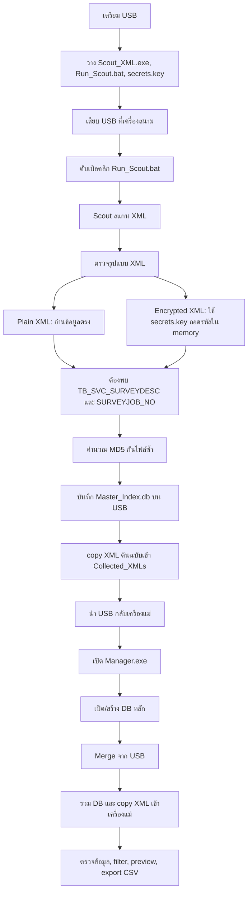

# MSI XML Collector Workflow

เอกสารนี้สรุปขั้นตอนใช้งานจริงตั้งแต่เตรียม USB, รัน Scout ที่เครื่องสนาม, จนถึง merge ข้อมูลเข้าเครื่องแม่ด้วย Manager

## 1. เตรียม USB สำหรับเครื่องสนาม

ก๊อปไฟล์จากโฟลเดอร์ publish ลง USB:

```text
publish\Scout_USB\
```

โครงสร้างใน USB ควรเป็นแบบนี้:

```text
USB:\
  Scout_XML.exe
  Run_Scout.bat
  secrets.key
```

หมายเหตุ:

- `Scout_XML.exe` คือโปรแกรมสแกน XML บนเครื่องสนาม
- `Run_Scout.bat` คือไฟล์สำหรับดับเบิลคลิกใช้งานง่าย และ pause หน้าต่างตอนจบ
- `secrets.key` ต้องวางข้าง `Scout_XML.exe` ถ้าต้องการอ่านข้อมูลจากไฟล์ encrypted

ถ้าไม่มี `secrets.key`:

- ไฟล์ plain XML ยังอ่านและบันทึก field ได้ตามปกติ
- ไฟล์ encrypted จะถูก skip เพราะ Scout ยืนยันไม่ได้ว่าเป็น DOLCAD survey XML จริง

Scout จะ copy เฉพาะไฟล์ที่ตรวจเจอว่าเป็น DOLCAD survey XML เท่านั้น:

- plain XML ต้องมี `TB_SVC_SURVEYDESC` และ `SURVEYJOB_NO`
- encrypted XML ต้องถอดรหัสได้ แล้วพบ `TB_SVC_SURVEYDESC` และ `SURVEYJOB_NO`

## 2. รัน Scout ที่เครื่องสนาม

1. เสียบ USB ที่เครื่องสนาม
2. ดับเบิลคลิก `Run_Scout.bat`
3. รอให้ Scout สแกนจนจบ
4. ตรวจ summary ตอนท้าย เช่น `Total`, `New`, `Dup`, `Skip`, `Err`
5. กด Enter เพื่อปิดหน้าต่าง

Scout จะสแกนอัตโนมัติ:

- `C:\DOLCAD_XML`
- `C:\Users\*\Desktop`
- `C:\Users\*\Documents`
- drive อื่น ๆ ที่เป็น fixed drive ยกเว้น drive ที่ Scout รันอยู่

Scout จะข้ามโฟลเดอร์ระบบ/backup บนทุก drive เช่น `Windows`, `Windows.old`, `Program Files`, `System Volume Information`, `$Recycle.Bin`, `Recovery` ดังนั้นถ้าเครื่องมี Windows อีกชุดอยู่ที่ `E:\Windows` จะไม่เข้าไปค้นในนั้น

## 3. ผลลัพธ์หลัง Scout รันเสร็จ

หลังรัน Scout แล้ว USB จะมีไฟล์/โฟลเดอร์เพิ่มขึ้น:

```text
USB:\
  Master_Index.db
  Collected_XMLs\
  Logs\
```

ความหมาย:

- `Master_Index.db` คือ SQLite database ที่เก็บ metadata ของ XML ที่พบ
- `Collected_XMLs\` คือไฟล์ XML ต้นฉบับที่ copy ออกมา
- `Logs\Scout_yyyyMMdd_HHmmss.log` คือ log รายละเอียดการรันแต่ละครั้ง

## 4. นำข้อมูลกลับเข้าเครื่องแม่

1. ถอด USB จากเครื่องสนาม
2. เสียบ USB ที่เครื่องแม่
3. เปิด `Manager.exe` จากโฟลเดอร์ `publish\Manager_PC\`
4. เปิด DB หลักของเครื่องแม่ หรือสร้างใหม่ถ้ายังไม่มี
5. กด `Merge จาก USB...`
6. เลือกไฟล์ `Master_Index.db` บน USB
7. รอให้ Manager merge records และ copy XML เข้าเครื่องแม่
8. โปรแกรมจะถามว่าจะลบ `Collected_XMLs` บน USB หรือไม่

คำแนะนำ:

- ถ้ายังไม่มั่นใจรอบแรก ให้ยังไม่ต้องลบ `Collected_XMLs` บน USB
- DB บน USB ควรเก็บไว้ เพื่อป้องกัน Scout collect ไฟล์ซ้ำในรอบถัดไป
- ถ้าต้องการ preview ไฟล์ encrypted ใน Manager ให้วาง `secrets.key` ข้าง DB หลักของเครื่องแม่ หรือข้าง `Manager.exe`

## 5. ใช้งาน Manager หลัง merge

ใน Manager สามารถทำงานต่อได้:

- ดูรายการ XML ทั้งหมด
- filter ตามจังหวัด/เครื่อง/คำค้นหา
- ดูเฉพาะรายการที่เลขที่สอบสวนซ้ำ
- คลิกแถวเพื่อดู metadata และ preview XML
- preview encrypted XML ได้เมื่อ Manager หา `secrets.key` เจอ
- export รายการที่กำลังแสดงเป็น CSV

## 6. Flow รวม


